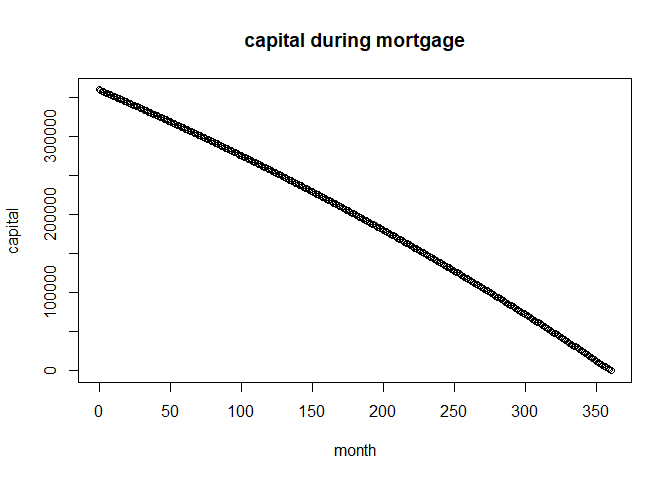
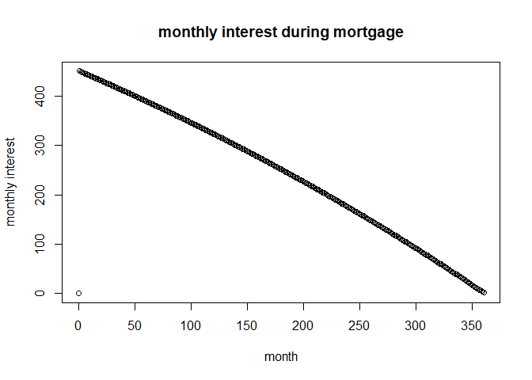

<!-- README.md is generated from README.Rmd. Please edit that file -->

# MortgageHelpers

<!-- badges: start -->
<!-- badges: end -->

The goal of MortgageHelpers is to provide functions to calculate aspects
of a mortgage including monthly payments, total terms and interest

## Installation

You can install the development version of MortgageHelpers from
[GitHub](https://github.com/) with:

``` r
# install.packages("devtools")
devtools::install_github("cuisquare/MortgageHelpers")
```

## Example

You can get the monthly payments for a mortgage as follows:

``` r
library(MortgageHelpers)
monthly_payment(rate = 0.015,
                capital = 360000,
                term_months = 30*12
                )
#> [1] 1242.433
```

You can also go for the whole mortgage details.

``` r
mortgage_first5years <- mortgage_state_allmonths(rate = 0.015,
                         capital = 360000,
                         term_months = 30*12,
                         month_num = 30*12)
#> Warning in mortgage_state_allmonths(rate = 0.015, capital = 360000, term_months
#> = 30 * : capital reduced to zero
```

You can then plot the various variables.




